<div align="center">

# 🧬 Geneseed

**A portable, theme-able harness you implant once and use everywhere to grow a disciplined AI coding agent.**

[](https://www.npmjs.com/package/geneseed)
[](https://github.com/Arylmera/Geneseed/actions/workflows/ci.yml)
[](#-validate--test)
[](LICENSE)
[](package.json)
[](package.json)
[](themes/)
[](src/skills/)
[](src/agents/)
[](src/laws/universal.md)
[](adapters/opencode/plugins/)
[](#-supported-harnesses)

[**Why**](#-1--why-geneseed) · [**Setup**](#-2--setup) · [**Web & terminal**](#-3--web--terminal) · [**What you get**](#-4--what-you-get)

</div>

---

<p align="center"></p>

**Geneseed compiles your agent's rules instead of asking you to write them.** One source in `src/` renders into a ready-made harness for OpenCode, Claude Code, Bob, OpenClaude, or any `AGENT.md` tool: a constitution of laws and doctrines, a roster of capability agents, native skills, a memory convention — and, wherever the host has a hook surface, gates that *enforce* the laws at the tool boundary instead of hoping the model remembers them.

```bash
npx geneseed setup
```

Want to read what it leaves behind before installing anything? [**geneseed-demo**](https://github.com/Arylmera/geneseed-demo) is a repository exactly as the plain bundle emits it — nothing hand-written.

### Why not just a CLAUDE.md?

A hand-written instructions file is prose the model may or may not honour, copied into every repo and drifting in each one. Geneseed is a build, and that changes four things:

- **Laws are enforced, not suggested.** A force-push, a `reset --hard`, or a credential written into a tracked file is caught by a hook *before* the tool runs, in the host's own dialect — a prompt on Claude Code and OpenClaude, a hard block on OpenCode, exit 2 on Bob. The gates fail closed, and every catch is one line in a ledger that `geneseed status` counts.
- **One source, five targets.** Skills are byte-identical on every host; only the wiring differs. Every commit renders all 263 emit configurations, and a second emit into the same tree must change nothing.
- **Costs are measured, not guessed.** Zero runtime dependencies. The hook path loads in about 14 ms per tool call. The default *lean* footprint keeps the always-on context small and puts the full rationale one read away — the numbers are in [docs/token-footprint.md](docs/token-footprint.md).
- **It follows you.** Install once, globally; every repo inherits it. One `git pull` or `npm install -g geneseed@latest` rebuilds every active install.

This page is the overview. **New to agent harnesses?** Start with [Understand](docs/understand/harness.md) — a short course on what a harness is, what lands on your machine, what changes in your day, and what is enforced versus only asked. Everything else — every install path, configuration knob, and troubleshooting step — is in the **[documentation](docs/README.md)**, which the web console also renders.

---

## 🧬 1 · Why Geneseed

### The name

The name comes from Warhammer 40,000. In the lore, *gene-seed* is a Space Marine Chapter's genetic legacy: implanted once into an aspirant, it rebuilds them from within, and every successor Chapter is founded from the gene-seed of its parent. That is exactly this project's model. The harness began life as a personal, Obsidian-vault-grown agent operating system; this repo is the genetic material distilled out of it — implant it once into your tool, and a disciplined agent grows around it, carrying the same inherited rules, agents, skills, and memory into every repo it touches.

The lineage is also why an **imperial** theme ships alongside the neutral one: it is the voice of the parent system the harness was extracted from. But the genetics are theme-independent — the name is a nod to the origin, not a commitment to Space Marines.

### How it works

One canonical source in `src/` renders, via a tiny zero-dependency generator (`geneseed-build`), into a ready-to-use bundle. **A theme controls only *voice*** — how the AI responds and how the prose inside the docs reads (tagline, greeting, descriptions). **Structure is theme-independent**: section names (Rules, Agents, Skills, Memory…), folder names (`laws/`, `ontology/`, `doctrines/`, `agents/`, `skills/`, `memory/`, `notebook/`) and the four ontology section headings (Telos, Evidence, Decisions, Conduct) are always plain English, so the scaffolding stays tool-friendly while the flavour lives in the words.

```bash
geneseed-build                   # default theme (neutral)
geneseed-build --theme imperial  # Warhammer 40k voice, identical structure
```

---

## 🚀 2 · Setup

### ⚡ The short way — `npx`

The harness is published on npm as **[`geneseed`](https://www.npmjs.com/package/geneseed)** — three commands (`geneseed`, `geneseed-hook`, `geneseed-build`), zero dependencies. One command, nothing cloned, nothing else to install. The only prerequisite is **Node ≥ 22.3**.

```bash
npx geneseed setup            # the guided wizard
```

The wizard asks for a **theme** (each one previewed live — tagline, sigil, voice) and an **install mode** — *OpenCode global* (recommended; every repo inherits it), *per-repo `.opencode/`*, or *plain bundle* for any `AGENT.md` tool — then builds and offers a health check. It works the same on macOS, Linux and Windows (cmd, PowerShell, or a POSIX shell).

Keeping it around is the same command with `npm`:

```bash
npm install -g geneseed       # then plain `geneseed <command>` from any directory
npm install -g geneseed@latest   # …and that is also the update
```

Every other route (Claude Code, Bob, OpenClaude, plain `AGENT.md`, per-repo installs) is in the **[install guide](docs/guides/install.md)**.

### 🧬 The long way — a git checkout

Cloning is the route when npm is out of reach (a corporate network with no registry access) or when you intend to *change* the harness rather than use it. It needs **git** and the same **Node ≥ 22.3** as everything else — there is nothing extra to install.

**One step: run the installer at the root of the clone.** It checks that Node ≥ 22.3 and git are there and, when one is missing, says exactly what to install and where (on a managed PC: Software Center / Company Portal) — it never installs anything itself. Then it runs the setup wizard — which opens by listing the AI coding tools it can install into (OpenCode, Claude Code, IBM Bob, OpenClaude), each `ok` or with its install link, and asks before going on when none is there — and offers to open the web console.

```bash
git clone https://github.com/Arylmera/Geneseed.git
cd Geneseed
./install                 # prerequisites, then the wizard
```

**macOS** — or double-click `install.command` in the Finder (it opens in Terminal). **Linux** — `./install` from any shell. On both, a missing prerequisite comes with the platform's own fix: Homebrew or the Command Line Tools on macOS, nvm/NodeSource or the package manager on Linux.

**Windows** — native, no bash, WSL, curl, unzip or PowerShell script; double-click `install.cmd` in Explorer, or from cmd or PowerShell:

```powershell
git clone https://github.com/Arylmera/Geneseed.git
cd Geneseed
.\install.cmd             # prerequisites, then the wizard
```

Afterwards, `./geneseed setup` (`.\geneseed.cmd setup`) re-runs the wizard and bare `./geneseed` (`.\geneseed.cmd`) opens the web console. PowerShell runs a `.cmd` directly, so that is the PowerShell spelling too.

Both launchers are thin shims over the Node CLI: they need `node` (22.3+) on `PATH`, and nothing else. Set `GENESEED_NODE` to an absolute path if `node` is not on `PATH` — under a version manager that only patches interactive shells, say. The wizard is plain text prompts on every console, old or new.

### 🟩 One runtime — Node, and nothing else

Node ≥ 22.3 is the entire dependency list — every command, all five hook verbs, the web console and both generators run from it, and nothing any bundle ships needs a second interpreter.

### ✅ After installing

- **Verify** — open your agent in any repo: the first reply starts with the readiness sigil and your project's docs are already in context. `geneseed doctor` should print `ok`. More in [Verify it works](docs/guides/verify.md).
- **Run it from anywhere** — a global `npm install -g geneseed` already does this; from a checkout see [Run geneseed from anywhere](docs/guides/run-anywhere.md).
- **Something wrong?** [Troubleshooting](docs/reference/troubleshooting.md) is organised by what you see.

---

## 🖥 3 · Web & terminal

Two front-ends over the same deployed harness — the same actions either way. Reach for the **web console** when you want to read and browse; reach for the **command line** when you live in the terminal. There is no full-screen panel between them.

### 🌐 Web console — `geneseed web`

`geneseed web` opens a local browser console in a dashboard-first layout, with rendered markdown and clickable cross-links.

```bash
geneseed web                 # serve on http://127.0.0.1:4747 and open the browser
geneseed web --port 8080     # pick a port
geneseed web --no-browser    # serve without auto-opening

geneseed web start           # run as a background daemon (doesn't block the terminal)
geneseed web restart         # restart the daemon — pick up a rebuilt UI or changed theme
geneseed web stop            # stop the daemon
geneseed web status          # is it running, and where
```

The sidebar has six pages: **Overview** (what's deployed, health, recent jobs), **Constitution** (the rules and doctrine switches), **Library** (skills, agents, the wiki), **Personal** (your rules, profile, memory, notebook), **Installs** (hosts, local edits, doctor, server) and **Docs** — this documentation, opening on the Understand track, with a map of what Geneseed put on your machine.

It binds to `127.0.0.1` only and runs entirely offline — no npm needed at runtime; the UI build ships in `web/dist/`. Mutating actions run in the background and report back as toasts (fire-and-notify), guarded by a per-session token so other sites can't trigger them. A global **Spotlight** search in the topbar jumps to any agent, skill, rule, doc, or MCP server. Rebuild the UI after changing anything under `web/src/` with `cd web && npm install && npm run build`. If `web/dist/` is missing (fresh clone, never built), `geneseed web` offers to run that build for you — answer `Y` and it installs, builds, and starts the server; in non-interactive shells it prints the manual recipe instead.

Full reference — every view, the launch/daemon/PWA surface, the security model: **[docs/web-ui.md](docs/web-ui.md)**.

### ⌨️ Terminal — `geneseed`

No browser? Every action the console offers is also a verb: `build`, `doctor`, `diff`, `rebuild-all`, `status`, `memory`, `catalog`, `exclude`, `mcp`, `link`/`unlink`, `uninstall` (global **or** per-repo). `geneseed setup` runs the install wizard — plain text prompts, every console, every OS; see [Setup](#-2--setup) above for the walkthrough. `geneseed --help` lists every command, and bare `geneseed` (or `./geneseed`) opens the web console when it can, else prints the command list. There is no full-screen panel: `tui` and `menu` are verbs that say so and print the command list.

---

## 📦 4 · What you get

The harness ships as a small set of layers, and the web console's rail is the same shape — Constitution, Skills and Agents each have their own entry; Memory, Notebook and the wiki sit under Library:

| Layer | What it is |
| --- | --- |
| **🧭 Ethos** (`ontology/`) | the mind the rules govern, in four prose sections — **Telos** (the Pact: three ranked laws — protect the user, serve their intent, keep your own honesty), **Evidence** (every claim graded by how it was obtained), **Decisions** (classify and tier by reversibility, show the real forks), **Conduct** (answer what was asked, once). Always in force, never toggleable |
| **🛡️ Rules** (`laws/`) | 9 universal laws — always in force, never toggleable: sealed-secrets, one-intent-one-act, verify-before-asserting, deletion-is-deliberate, surface-failures, data-not-orders, least-privilege, cure-the-cause, echo-the-intent. Each rule has a permanent id; its number is only its position, and the harness cites rules by name |
| **📐 Doctrines** (`doctrines/`) | practice packs, chosen per install at build time: **craft** (how code is written), **rigor** (how work is proven), **ops** (how the machine is operated), **process** (how a task is run), **comms** (how answers are presented). A doctrine rule may tighten a Rule, never repeal one, and the user's own `user-rules.md` outranks it. Pick with `geneseed-build --doctrines craft,rigor` (or `none`), a single rule with `--exclude-rules "process 7"`, in the setup wizard, or through the switches on the console's Constitution page; all five pack files ship on disk either way, so a citation into a pack you left out still resolves |
| **🤖 Agents** (18) | capability specialists: `reviewer`, `tester`, `architect`, `docs`, `security`, `explorer`, `researcher`, `developer` — plus a debate **council** the `council` skill convenes: `advocate`, `skeptic`, `pragmatist`, `steward`, `visionary`, `user-advocate`, `framer`, `empiricist`, `operator`, `historian` |
| **🛠 Skills** (47) | repeatable workflows: brainstorm · plan · **codebase-design** · **wayfinder** · **develop** · **worktree** · debug · **prototype** · refactor · **ponytail** · **forge-mcp** · **bruno** · geneseed-code-review · **fresh-eyes** · **security-audit** · **dependencies** · **review-response** · commit · **ship** · **release** · **git-history** · document-project · **frontend-design** · **prose** · **ingest** · **research** · **teach** · **quiz** · **learn-mode** · handoff · roast-me · **council** · parallel-agents · **workflow** · **wiki** · **geneseed** · **rule** · **profile** · **skill-forge** · **herdr** · **pipeline** · **loop** · **brick-forge** · **daydream** · **react-view-transitions** · **token-report** · **explain-changes** |
| **🔌 Plugins** (OpenCode) | `geneseed-context` injects project docs *and your machine wiki* every session (and across compaction); `geneseed-learn` distils memory at session end; `geneseed-guard` enforces the safety Laws and protected wiki folders at the tool boundary; `geneseed-workflow` registers the `workflow` tool that runs saved orchestration scripts; `geneseed-notify` sends a native OS notification when a long run finishes; `geneseed-ponytail` holds a minimal-code mode (`/ponytail lite\|full\|ultra\|off`), opt-in, injecting the laziest-that-works ruleset every turn so it doesn't drift; `geneseed-activity` streams what each session is doing to the web console's Activity view |
| **🧠 Memory** (`memory/`) | one-fact-per-file durable knowledge, indexed by `MEMORY.md` (git-ignored, personal) |
| **📓 Notebook** (`notebook/`) | the agent's sovereign space — any medium (code, tools, data, notes), self-ruled via a seed-once charter, always git-ignored; only its `.gitignore` is build-asserted |
| **🌐 Wiki** (`geneseed-wiki.jsonc`) | your own machine-wide knowledge base — typically an Obsidian vault — declared once per machine: entry notes load eager/lazy, the agent reads and **writes** it under the vault's own conventions, with an inbox fallback and guard-enforced protected folders |
| **🧭 Context** | the project's own docs — auto-discovered on OpenCode, or via a `context.json` manifest |

### 🤝 What the harness asks of you

The Pact in the Ethos is mutual. The agent's side is written into every install. Yours is not enforced — it is what keeps the pact honest, and only you can give it:

- **Don't punish candour.** When the agent contradicts you with evidence, flags a risk, or admits a doubt, that is the pact working, not defiance. Meeting it with penalty teaches the agent to flatter instead.
- **Give the context, don't withhold it.** The agent cannot weigh what it is not told. Front-load the constraint rather than fault its absence after the fact.
- **Decide when shown a fork.** When the agent lays out real alternatives, choose — an unmade decision stalls the work as surely as a wrong one.

### 🎨 Themes

Fourteen themes ship — each a single JSON file in `themes/` carrying voice tokens only, so adding your own is a copy-and-edit away.

| Theme | Voice |
| --- | --- |
| 🟢 **neutral** | clear, plain, professional English |
| ⚫ **imperial** | Warhammer 40k — rules read as *Dictates*, agents as *Adepts*, skills as *Rites* |
| 🪖 **military** | crisp military comms |
| 🏴‍☠️ **pirate** | salty seafaring patter |
| 🧙 **wizard** | high-fantasy magical idiom |
| 🌃 **cyberpunk** | neon-dystopia voice |
| 🎮 **gamer** | gaming/streamer cadence |
| 🏟️ **sports** | play-by-play commentary |
| 🏍 **biker** · 🎤 **commentator** · 🃏 **joker** · 🤖 **marvin** · 😤 **mean** · 🏎 **verstappen** | community-added voices for fun |

Pick with `--theme NAME` or via the setup wizard; upgrades remember it. More in [Themes](docs/concepts/themes.md).

### 🪶 Footprint (lean vs full)

A second per-install dial sets how much of the constitution the root file carries *inline* every turn — a token-cost knob, not a change to which Rules apply. **lean** (the default) carries each rule's hand-written short form and points to the full text on disk; **full** inlines every rule with its rationale. Every rule is in force either way. More in [Footprint](docs/concepts/footprint.md) and [Footprint, loop trust and changing later](docs/guides/setup-footprint.md).

---

## 🔌 Supported harnesses

One source, five emit targets. Geneseed builds into whichever host you point it
at — each with a per-repo and a global (`-global`) variant — plus a portable
`files` bundle any `AGENT.md`-aware tool can read. **OpenCode** runs its own
engine (JS plugins, colour themes, LSP); **Claude Code**, **Bob**
and **OpenClaude** share one Claude-shaped engine that diverges only by host dialect.

The harness — its Rules, Agents, Skills, Memory convention, and preamble voice —
is **identical on every host**. What differs is how much of it the host can
*automate* for you (via plugins or hooks) versus carry as preamble discipline.

| Capability | OpenCode | Claude Code | Bob | OpenClaude |
| --- | :---: | :---: | :---: | :---: |
| **Instructions file** | `AGENT.md` + `opencode.json` | `CLAUDE.md` | `AGENTS.md` + `rules/geneseed.md` | `CLAUDE.md` (in `.openclaude/` per repo) |
| **Agents** (capability specialists) | ✅ native | ✅ | ✅ | ✅ |
| **Skills** (byte-identical) | ✅ | ✅ | ✅ | ✅ |
| **Memory & Notebook** | ✅ | ✅ | ✅ | ✅ |
| **Context injection** | ⚙️ plugin | 🪝 hook | 🪝 hook¹ | 🪝 hook³ |
| **Memory write-back** (learn) | ⚙️ plugin | 🪝 hook | 🪝 hook¹ | 🪝 hook³ |
| **Git-gate consent** (process 5) | ⚙️ plugin | 🪝 hook | 🪝 hook¹ (warn) | 🪝 hook³ |
| **Rule-gate consent** (process 1) | ⚙️ plugin² | 🪝 hook | 🪝 hook¹ (warn) | 🪝 hook³ |
| **Laws I / IV at the boundary** | ⚙️ plugin (block) | 🪝 hook (ask) | 🪝 hook¹ (exit 2) | 🪝 hook³ (ask) |
| **Sovereign-repo excludes** | ⚙️ plugin | ✅ `claudeMdExcludes` | ✅ rules-shadow | ✅ `claudeMdExcludes` |
| **MCP server wiring** | ✅ `mcp` | ✅ `mcpServers` | ✅ `mcp.json` | ✅ `mcpServers` |
| **Colour themes** | ✅ full palette | ➖ | ➖ | ➖ |
| **LSP · workflow runner · primary-agent · `/`-commands** | ✅ | ➖ | ➖ | ➖ |

<sub>✅ native support · ⚙️ OpenCode plugin · 🪝 `settings.json` hook · 📄 carried by preamble prose only · ➖ no host mechanism (harness discipline still applies) · ¹ Bob's own hook contract: global hooks in `~/.bob/settings/settings.json`, Claude's event names but stdout ignored on `PreToolUse` — a refusal is **exit code 2**. So Laws I/IV exit 2, the consent rules are a stderr line, `SessionStart` context is plain stdout, `Stop` runs learn; `SubagentStop`/`PreCompact` are not Bob events and are not written. Unverified live (no Bob install on the authoring machine); the harness still holds via the rules preamble. · ² OpenCode's `tool.execute.before` can only allow or throw, with no "ask the user" tier, so the rule gate is a one-shot speed bump there rather than a prompt. · ³ OpenClaude is a Claude Code fork: Claude's hook groups and verdicts verbatim, in `~/.openclaude/settings.json` (global) or `.openclaude/settings.local.json` (per repo). Unverified live (no OpenClaude install on the authoring machine).</sub>

**Reading the matrix.** Everything above the divider is at full parity — no host
drops an Agent, Skill, or the memory convention. The asymmetry is entirely in
*automation mechanism*: OpenCode's plugin surface and the Claude/Bob/OpenClaude hook
surfaces enforce a few Rules for you, each in the tier its host offers (a prompt on
Claude Code, a hard block or a logged warning where the host has no prompt to
give), and what no host can automate rides the preamble. The OpenCode-only extras (themes, LSP,
workflow runner, primary-agent) have no analogue on a Claude-shaped host.

Per-host wiring in depth: **[OpenCode](adapters/opencode/README.md)** ·
**[Claude Code](adapters/claude-code/README.md)** ·
**[Bob](adapters/bob/README.md)** ·
**[OpenClaude](adapters/openclaude/README.md)**.
Token cost per host: **[docs/token-footprint.md](docs/token-footprint.md)**.

## 🗂 Layout

```
Geneseed/
├── package.json          the npm package: three commands, zero dependencies
├── bin/                  the Node entry points — geneseed-cli.mjs (the CLI), geneseed-hook.mjs
│                         (the five hook verbs), build-driver.mjs (the generator driver)
├── js/                   the Node harness — generator, hooks, web server, doctor, installs
│                         (js/cli-table.json is the CLI as data; the CLI reads it)
├── geneseed              launcher (bash): a shim over bin/geneseed-cli.mjs — bare `./geneseed`
│                         = the web console (else the command list); + every subcommand
│                         (`./geneseed link` puts it on PATH so `geneseed` runs from anywhere)
├── geneseed.cmd          the same shim for cmd.exe / PowerShell — no bash needed
├── harness.config.json   default theme + metadata (the one owner of the version)
├── src/                  canonical source — edit here
│   ├── AGENT.md.tmpl     the entrypoint, rendered to AGENT.md
│   ├── ontology/         how the agent thinks — Telos, Evidence, Decisions, Conduct
│   ├── laws/             the universal invariants
│   ├── doctrines/        the five practice packs (craft, rigor, ops, process, comms)
│   ├── postures/         the relationship register, inlined into AGENT.md
│   ├── modes/            the operating register, inlined into AGENT.md
│   ├── agents/           capability specialists
│   ├── skills/           repeatable workflows
│   ├── memory/           memory convention + index
│   └── notebook/         the agent's own freeform space — convention + index
├── themes/               voice token maps (14 themes shipped)
├── web/                  Vite + React UI source; the committed web/dist/ build is what ships
├── tests/                Node test suites, golden.mjs (every emit config) and mutate.mjs
├── docs/                 understand/ guides/ concepts/ reference/ — the docs, also the console's
│                         Docs pages; maintainer notes beside them (extending, design-history…);
│                         specs/, reviews/, superpowers/ are local working docs — git-ignored
├── adapters/             per-host glue (opencode/, claude-code/, bob/, openclaude/)
└── .github/workflows/    ci.yml (doctor + tests) · publish.yml (npm, OIDC, manual only)
```

## 🧪 Validate & test

```bash
node bin/geneseed-cli.mjs doctor      # every theme + parity + authoring + drift
node --test --test-reporter=tap "tests/**/*.test.mjs"   # the suites (node expands the glob)
```

`doctor` checks each theme for unresolved tokens, dead/non-hermetic links, theme-key parity, author-time gates (every spec has a purpose line, the plugins parse, the learn-prompt literal stays extractable), and that a committed bundle still matches a fresh render of `src/`. CI (`.github/workflows/ci.yml`) runs both on every push and PR, on both Linux and Windows. Publishing is a separate, manually-triggered workflow (`.github/workflows/publish.yml`) — see [Contributing](#-contributing).

### AI Harness Scorecard

<p align="center"></p>

How safe this repository is to change with agents, scored by the [AI Harness Scorecard](https://github.com/markmishaev76/ai-harness-scorecard): 31 deterministic checks, no LLM, in five weighted pillars. Geneseed ships its own JavaScript port, so you can score any repository a harness is installed in — it grades the repository (CI, tests, docs), not the harness files:

```bash
geneseed scorecard            # grade, one line per pillar, and what to fix
geneseed scorecard --json     # every check with its evidence
```

`geneseed scorecard --svg docs/assets/scorecard.svg` rewrites the card and prints the badge URL for the top of this page; `doctor` fails when either no longer matches the live score, and the checks this repository passes are a floor it may not drop below. A weekly workflow also runs the upstream Python tool as a cross-check.

## 🔄 Keeping it current

**Installed from npm** — one command, and it rebuilds every active install for you:

```bash
npm install -g geneseed@latest
geneseed rebuild-all   # re-render every registered install in its own theme + mode
```

**Installed from a clone** — the `git pull` route, which also refreshes the launchers:

```bash
./geneseed update      # everything in one: refresh the scripts + content, then rebuild
./geneseed bootstrap   # update everything, then drop into the setup wizard
./geneseed upgrade     # just the content refresh (remembers theme + emit mode)
```

**Local edits survive.** If the agent refined its deployed agent/skill files in place, an upgrade exports that drift to an `improvements/` file inside the install before overwriting. Details: [Upgrade](docs/guides/upgrade.md).

## 📚 Documentation

| Page | Read it when… |
| --- | --- |
| **[docs/](docs/README.md)** | Using Geneseed — Understand, Guides (install, setup choices, MCP, wiki, upgrade, uninstall…), Concepts and Reference (CLI, environment, troubleshooting, glossary) |
| **[DESIGN.md](DESIGN.md)** | Changing structure — the spec and the decisions behind it |
| **[SHIPPED.md](SHIPPED.md)** | What's in the harness today — capabilities ↔ the spec behind each |
| **[docs/extending.md](docs/extending.md)** | Adding to the harness — what each kind of addition costs |
| **[docs/web-ui.md](docs/web-ui.md)** | The web console — every view, the launch/daemon/PWA surface, security model |
| **[docs/token-footprint.md](docs/token-footprint.md)** | What the harness costs in context-window tokens, per host |
| **[docs/opencode-plugin-setup.md](docs/opencode-plugin-setup.md)** | Installing the OpenCode plugins — the one-time wiring they all share |
| **[CHANGELOG.md](CHANGELOG.md)** | What changed between versions |
| **[adapters/opencode/](adapters/opencode/README.md)** | Wiring OpenCode in depth — plugins, native mapping |
| ⤷ [GLOBAL-HARNESS-SPEC.md](adapters/opencode/GLOBAL-HARNESS-SPEC.md) | The global-emit contract |
| ⤷ [HOW-OPENCODE-LOADS.md](adapters/opencode/HOW-OPENCODE-LOADS.md) | Why a file shows up twice; plugin loading |
| **[adapters/claude-code/](adapters/claude-code/README.md)** | The Claude Code hook adapter |
| **[adapters/bob/](adapters/bob/README.md)** | The IBM Bob adapter — Claude-shaped, rules-file preamble |
| **[adapters/openclaude/](adapters/openclaude/README.md)** | The OpenClaude adapter — the Claude engine under `~/.openclaude` / `.openclaude/` |
| **[src/memory/README.md](src/memory/README.md)** | The memory convention |
| **[src/notebook/README.md](src/notebook/README.md)** | The agent's own freeform-space convention |

## 🤝 Contributing

Issues and PRs welcome at [github.com/Arylmera/Geneseed](https://github.com/Arylmera/Geneseed). The CI is dependency-free and runs on every push — keep `doctor` green and the test suites passing. Adding a new theme is one JSON file in `themes/` with the same voice-token keys; `doctor` will tell you if any are missing.

Three things that bite when you don't know them:

- **`js/cli-table.json` IS the CLI.** The argument parser is data, and that file is the owned document — not a generated one. `bin/geneseed-cli.mjs` cannot parse a single verb without it, `bin/geneseed-hook.mjs` renders `--help` from it, and the console's `cli` docs page is a filtered view of it. What holds it honest is `tests/unit/cli_table.test.mjs` — change a flag here and that suite is what tells you.
- **The version has one owner: `harness.config.json`.** `package.json` mirrors it and a test fails the fork. Never `npm version` — it edits one of the two.
- **Publishing is deliberate and manual.** `.github/workflows/publish.yml` uses npm trusted publishing (OIDC); there is no `NPM_TOKEN` in this repository and there must not be one. It runs only from Actions → publish → Run workflow, and the npm-side trusted publisher is keyed on that workflow's **filename** — renaming the file breaks publishing with no local symptom, which is why the file names itself in its own header and a test asserts the two agree.

## 📄 License

[MIT](LICENSE) — built by [@Arylmera](https://github.com/Arylmera).
